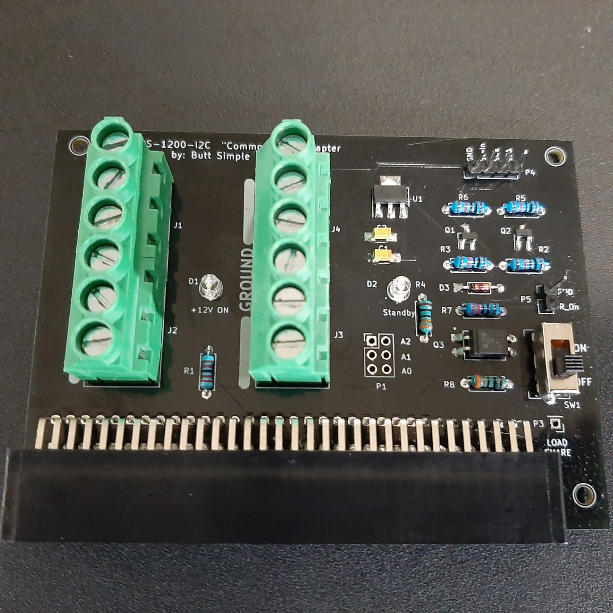
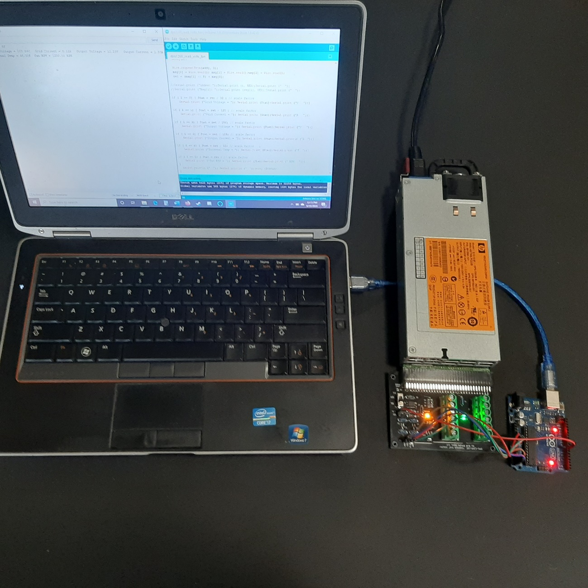

# Objective

We are obsessed with server power supplies that we can adapt for hobby use. They
are compact, cheap, highly intelligent, and can just push a ton of current! We
began by designing and manufacturing simple connectivity adapters for Intel and
HP server supplies. We learned that hobbyists were looking for more precise ways
to monitor and control these supplies for their projects; so, we decided to
build an adapter that does just that. You can monitor and control the Common
Slot supplies easily, without modifying the supply to turn any HP Common Slot
compatible power supplies on/off as well as to communicate with them via the
supply’s I2C interface. The user can read line voltage, current, and power,
output voltage, current, and power, temperature, supply status, fan speed, and
various other flags and parameters in real time. It also lets the user change
settings within the supply like fan speed, and read and write to an internal
EEPROM. To prove the design, we also wrote several Arduino sketches that read
information from the supply, and control the supply. The sketches in this
repository are freely available to anyone.

# The HP Power Supply

Although several server supplies were designed to communicate with their
respective servers, we chose the HP Proliant “Common Slot” (CS) series of
supplies for this project since they are inexpensive and already popular with
RC, LiPo charger, mining, audio, and Ham hobbyists. Common Slot supplies come in
various part numbers based on wattage and efficiency ratings. Most commonly they
can be found in 460 (DPS-460), 750 (DPS-750), and 1200 (DPS-1200) Watts.

For example, the most common is the HP "DPS-1200FB A", which is a small foot
print, high efficiency, 12 Volt Enterprise Server switching power supply (1.5″ x
7.75″ x 3 1/2″ and weighing in at around two pounds each with a capability to
supply 900W (75A at 12V) on 110V. Now THAT’S crazy!). It operates on 110 or 220
volts, to provide 900 watts or 1200 Watts respectively. This supply offers a
high quality and inexpensive way to power devices requiring 12-volt power such
as Bitcoin mining equipment and electronics projects. Through testing I have
found these supplies to operate at typical-load efficiency of 85-92%; but as
expected, results will vary between supplies and the load you are placing on it.
We have customers that use these supplies for LiPo charging, RC, Car Audio,
Mining, HAM, and many other cool ideas. I have seen these supplies for sale on
eBay and Amazon used for under \$20 – and that included shipping! We have
purchased our share of them too \<grin\>.

If your output voltage is not what you want it to be, this supply has an
internal voltage adjustment! Details of how to adjust the output voltage in a
range of approximately 11.7V to 12.7V can be found at websites like
<http://www.rchelination.com>. Other modifications are published to increase the
voltage output to make it viable for 13.8V HAM projects.

# I2C Capabilities

Depending on the Common Slot supply, there may be 2 or 3 internal devices
accessible via I2C. Every Common Slot supply will allow access to a 256x8 2402
EEPROM, and a 16F886 PIC microcontroller. Unfortunately, it does not seem to
conform to PMBus or SMBus message standards, so even with community support, so
far only a limited amount of information has been decoded. The EEPROM contains
manufacturer information, and can be repurposed to store information that you
would like to save in EEPROM memory. Some supplies have a device at 0x4F. Based
on the address, this could be a separate I2C precision Voltage/Current/Power
monitor like an INA260, or a Temperature sensor like PCT2075. We have not
explored this yet, but tell us what you figure out!

# The Adapter Hardware

We produced a hardware adapter that mates with the edge connector of the power
supply to make this project easier. Since the Arduino Uno is a popular 5V
hobbyist microcontroller, we wanted to make an adapter that was designed to
interface to this inexpensive and popular Arduino board. The DPS-1200 I2C buss
is a 3.3V logic buss; therefore, this adapter has an on-board 3.3V regulator,
and 5V \<\> 3.3V I2C level shift logic. An optocoupler circuit is used to
interface an Arduino Digital Output pin to the power supply. Here is a view of
the adapter:

The 2-pin header is the “R_On” header. It is meant to be connected to a Digital
Out pin of the Arduino to turn the DPS_1200 ON and OFF under Arduino control.
The manual switch is required to be in the OFF position, and connection to the
I2C is not required for this functionality to operate. This is needed since e
have not found an I2C command to turn ON / OFF the supply – can you?

The 4-pin header has pins for 5V, Ground, SDA, and SCL. All of these pins are
connected to the Arduino. We noted some Common Slot supply variants seem to
require the SDA and SCL to be swapped to operate. If you cannot communicate with
the supply, this may be a troubleshooting step. Additionally, some variants
appear to provide I2C data out while the supply is off and plugged into main
power; while other part numbers require the supply to be operating to
communicate via I2C.

The ”Load_Share” test point is required only if you are connecting multiple
supplies together, preventing one supply from shutting down. Connecting the
“Load_Share” pins of supplies together allows the PIC controller in the supplies
to balance the load between them.

A0-A2 changes the I2C address of the PIC on the I2C buss. This allows more than
one supply to be connected to I2C and communicate with the microcontroller. If
left open (“1”), the 2402 EEPROM will be address 0x57 and the PIC will be at
address 0x5F.

Here is an adapter connected to an Arduino Uno and a laptop

We have made a dozen or so adapters, if the demand is strong, we can always make
more. To obtain one of these adapters, visit our eBay store at:
<https://www.ebay.com/str/buttsimpleideas>

# Software

Arduino IDE was used because of its popularity in the hobbyist community.
However, this project could have been done using Python, C++, or virtually any
embedded microcontroller language. The Arduino sketches here are provided to get
you up and running, with a focus on keeping it simple.

## About the CRC

Reading and writing to the EEPROM does not require sending a CRC; however, a CRC
(AKA: Packet Error Code - PEC) is required to read and write to the PIC. The
sequence of commands to the supply is important but straight forward.

CRC polynomials can be reverse engineered by brute force. But thankfully, the
method HP used a simple and common CRC-8 polynomial algorithm. The polynomial
used is P(x) = x8+ x2+ x1+ x0, with a bit sequence of 100000111. If you need a
sanity check, the values 0x58 and 0x40 (Base supply address and Fan speed
register) yields a CRC result of 0x63 hex. There are a lot of good tutorials
regarding CRC generation on YouTube and the web.

## The Sketches

These sketches were tested on DPS-1200 and DPS-750 supplies, but are expected to
work on all common slot supplies. The I2C sketches can be used without the
adapter, but soldering the connections to the power supply, and using a 3.3v
compatible microcontroller to properly interface to the 3.3V Power Supply I2C
interface is required. Powering on/off the supply requires hardware interfacing
as well.

These sketches were written to be butt simple, with very little fluff. The
concept was to provide a minimal core functionality that you can expand on. Each
sketch is remarked to provide ample information on its operation.

# About Butt Simple Ideas, LLC

We specialize in solutions for hobbyists, with an emphasis on adapting Server
grade supplies for hobby use. Need a product, or have an idea? Go to:
<http://www.buttsimpleideas.com/> or contact: <garrymercaldi@hotmail.com>.

# Kudo’s

Development depends on the ability to leverage from the experiences of those
that came before you. Significant shout out goes to 2 main sources of
information in the development of the hardware and software for this project:

<https://github.com/raplin/DPS-1200FB> - Dr. Tune (Richard Aplin) provided a
great start in reverse engineering the DPS-1200. Note: We use Ghidra, the NSA's
open-sourced decompiler toolkit, which has a processor selection for
PROCESSOR_PIC_16 and is relatively easy to use. Richard used IDA Pro (IDA
Starter Licenses start at \$589 USD, whereas prices for IDA Professional
Licenses start at \$1129 USD), which is a professional but expensive tool with
an integrated debugger. Ghidra does not have a debugger, so some of the reverse
engineering was a bit challenging for us – but the price is right (free).

<https://github.com/slundell/dps_charger> - Slundell used the DPS-1200 supply,
Arduino, and modified hardware to create a LiPo battery charger. A significant
and rather complex undertaking – nice work.
